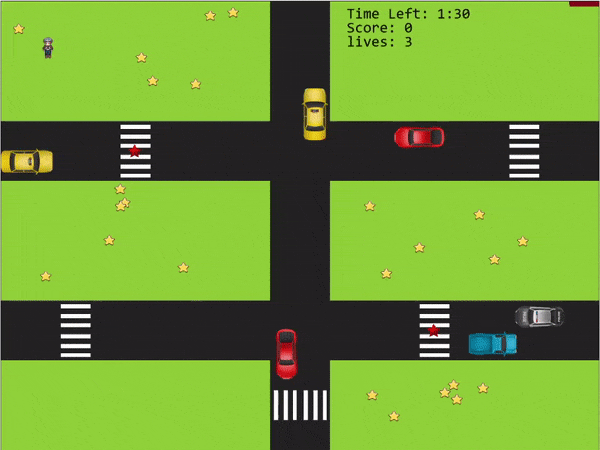

# HTML5 Phaser Game

PHASER
================

Phaser is a 2D game framework developed by Photon Storm used for making HTML5 games for desktop and mobile.  
Phaser uses both a Canvas and WebGL renderer internally and can automatically swap between them based on browser support

Game logic:
----------
The Player must collect all the Stars (yellow and red) and arrive at his destination
on time and Without being hit by vehicles. 

- For the 2D scene i Generated the map using The Flexible Map editor  [Tiled](https://www.mapeditor.org/).  
- The physics Propreties consists of collision between the player and the vehicles. 
- The vehicles collides at some point so i had to come up with some sort of traffic rules to prevent that,  
  so i gave the priority to the center road, the other vehicles had to stop while there is a car on the central road in their way.  
  
To-do:
----------
- Trajectories: the vehicles can change directions (Gotta come up with more traffic rules for that)  
- Levels: have more levels with difficulty rising with each level up.  
- PowerUp: figure out some powerups, maybe more health or invincibility for a short period of time.  
